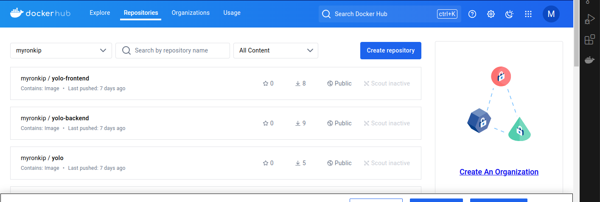

## 1. Choice of Base Image
 The base image used to build the containers is `node:16-alpine3.16`. It is derived from the Alpine Linux distribution, making it lightweight and compact. 
 Used 
 1. Client:`node:16-alpine3.16`
 2.Mongo : `mongo:6.0 `
       

## 2. Dockerfile directives used in the creation and running of each container.
**Client Dockerfile**

```
# Build stage
FROM node:16-alpine3.16 as build-stage

# Set the working directory inside the container
WORKDIR /app

# Copy package.json and package-lock.json
COPY package*.json ./

# Install dependencies and clears the npm cache and removes any temporary files
RUN npm install --only=production && \
    npm cache clean --force && \
    rm -rf /tmp/*

# Copy the rest of the application code
COPY . .

# Build the application and  remove development dependencies
RUN npm run build && \
    npm prune --production

# Production stage
FROM node:16-alpine3.16 as production-stage

WORKDIR /client

# Copy only the necessary files from the build stage
COPY --from=build-stage /client/build ./build
COPY --from=build-stage /client/public ./public
COPY --from=build-stage /client/src ./src
COPY --from=build-stage /client/package*.json ./

# Set the environment variable for the app
ENV NODE_ENV=production

# Expose the port used by the app
EXPOSE 80

# Prune the node_modules directory to remove development dependencies and clears the npm cache and removes any temporary files


# Start the application
CMD ["npm", "start"]

```

## 3. Docker Compose Networking
The (docker-compose.yaml) defines the networking configuration for the project. It includes the allocation of application ports. The relevant sections are as follows:


```
services:
  backend:
    # ...
    ports:
      - "5000:5000"
    networks:
      - yolo-network

  client:
    # ...
    ports:
      - "80:80"
    networks:
      - yolo-network
  
  mongodb:
    # ...
    ports:
      - "27017:27017"
    networks:
      - yolo-network

networks:
  yolo-network:
    driver: bridge
```
In this configuration, the backend container is mapped to port 5000 of the host, the client container is mapped to port 80 of the host, and mongodb container is mapped to port 27017 of the host. All containers are connected to the yolo-network bridge network.


## 4.  Docker Compose Volume Definition and Usage
The Docker Compose file includes volume definitions for MongoDB data storage. The relevant section is as follows:

yaml

```
volumes:
  mongodata:  # Define Docker volume for MongoDB data
    driver: local

```
This volume, mongodb_data, is designated for storing MongoDB data. It ensures that the data remains intact and is not lost even if the container is stopped or deleted.

## 5. Git Workflow to achieve the task

To achieve the task the following git workflow was used:

1. Fork the repository from the original repository.
2. Clone the repo: `https://github.com/Vinge1718/yolo`
3. Create a .gitignore file to exclude unnecessary     files and directories from version control.
4. Updated Dockerfile for the client to the repo:
`git add client/Dockerfile`
6. Committed the changes:
`git commit -m "Added Dockerfiles"`
7. Updated docker-compose file to the repo:
`git add docker-compose.yaml`
8. Committed the changes:
`git commit -m "Added docker-compose file"`
9. Pushed the files to github:
`git push `
10. Built the client and backend images:
`sudo docker build -t myronkip/yolo-frontend:v1.0.5 .`
11. Pushed the built imags to docker registry:
`docker compose push`
12. Deployed the containers using docker compose:
`docker compose up`

13. Created explanation.md file and modified it as the commit messages in the repo will explain.

##Dockerhu screenshot
